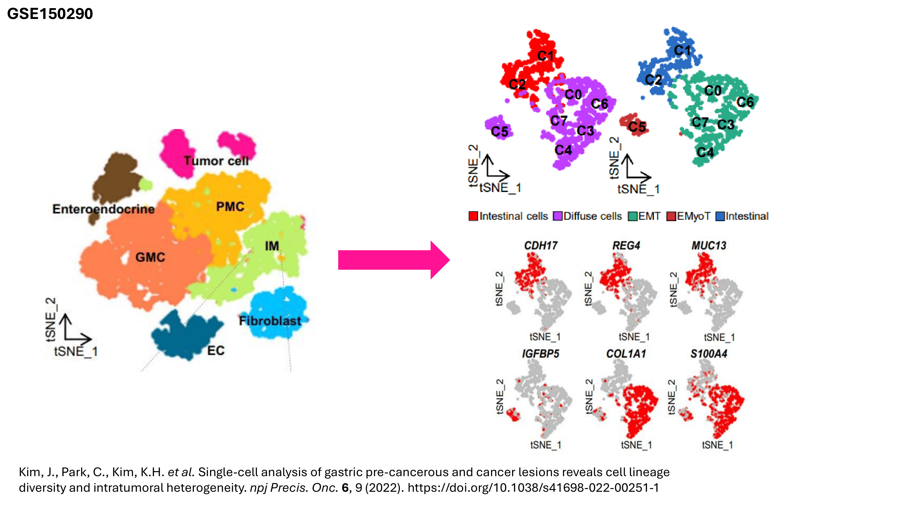
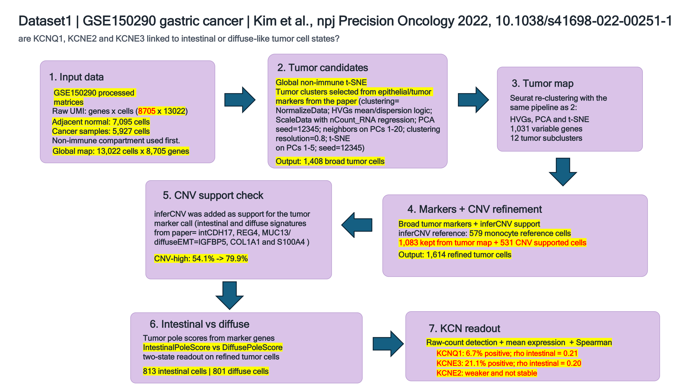

# Gastric_KCNQ1

## Internship context

These analyses were made during a six-month Master 1 bioinformatics internship in the Regulations of Ion Channel in Cancer laboratory. The team studies how ion channels contribute to cancer biology, with projects focused on PDAC and gastric cancer. The laboratory is part of Universite Cote d'Azur and affiliated with CNRS and Inserm.

This repository contains a single-cell RNA-seq analysis based on `GSE150290`, coded in the context of the team working on the regulation of ion channels in cancer, and more specifically around the gastric cancer questions explored in Raphael Rapetti-Mauss' team.

Basically, the aim of this analysis was to test whether `KCNQ1`, `KCNE2`, and `KCNE3` are associated with a broad intestinal/diffuse tumor axis in gastric cancer.

Source study:

- Kim J, Park C, Kim KH, et al. *Single-cell analysis of gastric pre-cancerous and cancer lesions reveals cell lineage diversity and intratumoral heterogeneity*. **npj Precision Oncology**. 2022;6:9.
- DOI: [10.1038/s41698-022-00251-1](https://doi.org/10.1038/s41698-022-00251-1)
- GEO: `GSE150290`

## Biological context

This side project, as introduced, is part of the team's broader research aimed at understanding how ion channels contribute to epithelial homeostasis, cellular plasticity, and tumor progression in gastrointestinal cancers. The work of Raphael Rapetti-Mauss and his team has shown that ion channels are not only transport proteins but also regulators of differentiation, signaling, and cancer-related phenotypes, particularly epithelial organization and programs associated with the Wnt/beta-catenin pathway. In this context, studying the `KCNQ1` (and `KCNE2` and `KCNE3`) genes in gastric cancer at single-cell resolution is relevant for determining whether these genes are linked to specific malignant epithelial states, particularly depending on whether the tumor is intestinal-type or diffuse-type. This would also be consistent with the known role of `KCNQ1` in epithelial organization. Indeed, work from Raphael Rapetti-Mauss and his team showed that `KCNQ1` helps maintain an epithelial differentiated state, whereas its inhibition or loss favors beta-catenin redistribution, reduced epithelial integrity, and a more proliferative phenotype. Therefore, finding higher `KCNQ1` expression in intestinal-type tumor cells would be biologically coherent with a more epithelial and differentiated program ([10.1073/pnas.1702913114](https://doi.org/10.1073/pnas.1702913114)).

## Folder structure

- `bibliography/`
  Source paper and supplementary methods.
- `pipeline_markers_only/`
  Main analysis branch.
- `pipeline_markers_plus_cnv/`
  Same analysis with an additional CNV-based refinement step.
- `cache/`
  Processed GEO matrices used in the workflow.
- `raw_geo/`
  Raw GEO files kept locally for traceability and CNV reruns.
- `deps/`
  Local dependency files used during setup.

## Pipeline summary

The workflow was reproduced as closely as possible from the paper using the parameters reported in the article and supplementary methods.

Two complementary branches were used:

### 1. `pipeline_markers_only`

- build the global non-immune atlas from the processed GEO matrices
- identify the broad tumor compartment
- re-cluster tumor cells with paper-like Seurat settings
- define a broad intestinal-versus-diffuse tumor axis
- project `KCNQ1`, `KCNE2`, and `KCNE3`

### 2. `pipeline_markers_plus_cnv`

- keep the same global logic
- add an inferCNV-based validation layer
- refine the tumor compartment with marker and CNV support
- re-evaluate `KCNQ1`, `KCNE2`, and `KCNE3` in the refined tumor map

## Pipeline flowchart

## Paper fidelity

This repository follows the published workflow as closely as possible from the material available locally.

It is not exactly the same pipeline as the original study because the authors' full code and detailed internal annotations were not available. The reconstruction therefore relies on the paper, the supplementary methods, and the released matrices.

## Main result

Across the two branches, the interpretation stayed consistent:

- `KCNQ1` is more intestinal-oriented
- `KCNE3` follows the same direction
- `KCNE2` is weaker

## Main files

Figures:

- `pipeline_markers_only/outputs/tumor_poles/figures/tumor_all_global_intestinal_diffuse_annotated.pdf`
- `pipeline_markers_only/outputs/kcnq1/figures/KCNQ1_featureplot_global_and_tumor.pdf`
- `pipeline_markers_only/outputs/kcne2_kcne3/figures/KCNE2_featureplot_global_and_tumor.pdf`
- `pipeline_markers_only/outputs/kcne2_kcne3/figures/KCNE3_featureplot_global_and_tumor.pdf`
- `pipeline_markers_plus_cnv/outputs/global_cnv_screen/figures/global_tsne_tumor_markers_and_cnv_like_genes.pdf`
- `pipeline_markers_plus_cnv/outputs/refined_kcnq1_kcne2_kcne3/figures/refined_tumor_KCNQ1_KCNE2_KCNE3_multiplot.pdf`

Excel documentation:

- `pipeline_markers_plus_cnv/outputs/final/GSE150290_pipeline_signature_sources.xlsx`

Scripts:

- `pipeline_markers_only/scripts/run_global_nonimmune_tumor_extraction.R`
- `pipeline_markers_only/scripts/run_all_global_tumor_cells_exact_paper_pipeline.R`
- `pipeline_markers_only/scripts/annotate_broad_tumor_tsne_intestinal_diffuse.R`
- `pipeline_markers_plus_cnv/scripts/run_infercnv_on_existing_global_tsne.R`
- `pipeline_markers_plus_cnv/scripts/refine_tumor_compartment_markers_plus_cnv.R`
- `pipeline_markers_plus_cnv/scripts/plot_refined_kcnq1_kcne2_kcne3_and_spearman.R`
